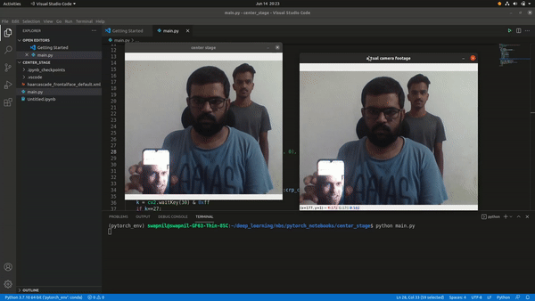

# Center Stage

This repo contains my implementation of center stage feature inspired from apple.
The original feature can be found <a href='https://www.youtube.com/watch?v=XlYQ7UG2TQA'> here </a>

# Usage
For using the code you only need 2 things,
1. Python
2. OpenCV

Install those 2 things and execute main.py
After that you will see 2 windows,
 1. Direct footage from web camera
 2. Center stage footage

# Quick Demo

